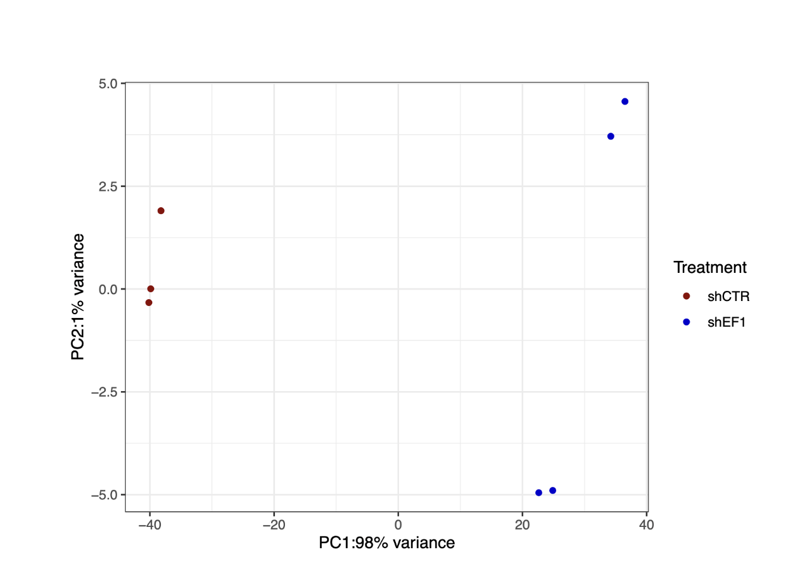
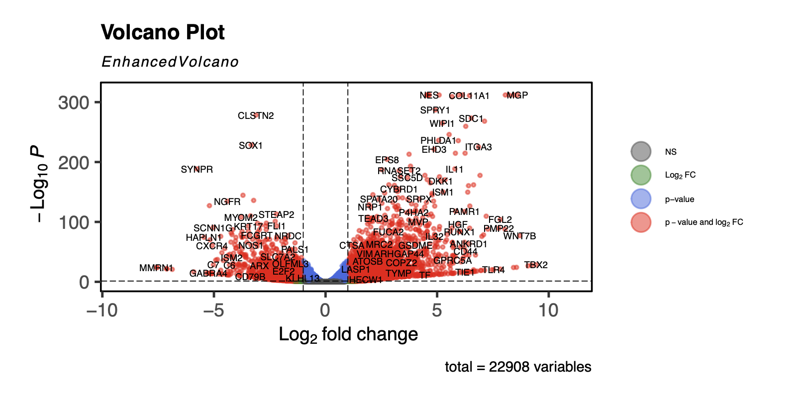
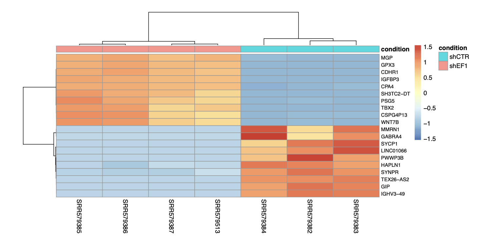
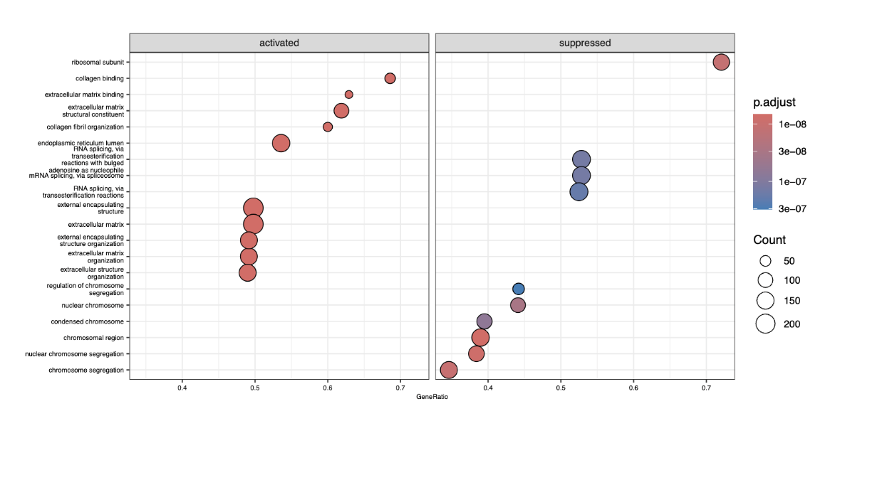
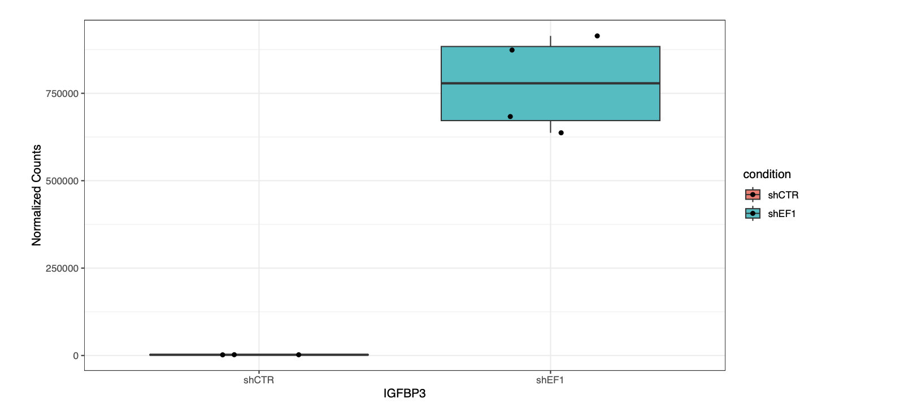
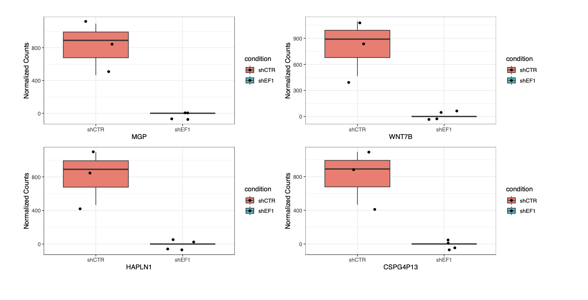
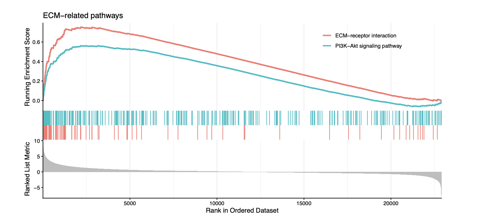
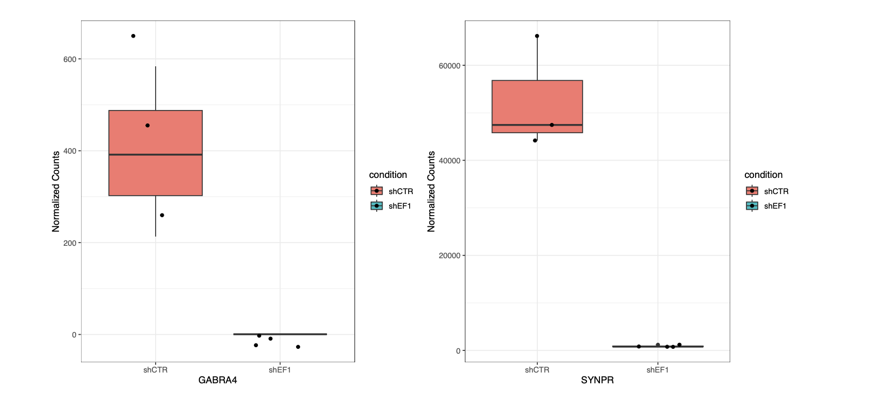
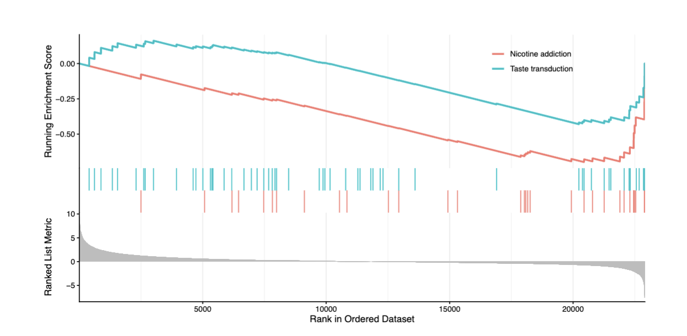

# Ewing Sarcoma
---
Ewing sarcoma is an aggressive malignancy that arises in bone or soft tissue and typically presents with pain, swelling, or palpable masses, most often in the legs or pelvis. Over 85% of cases are driven by the oncogenic fusion protein EWS–FLI, which is widely regarded as the primary driver of tumor initiation and progression. Understanding how EWS–FLI alters gene regulation is therefore critical for elucidating Ewing sarcoma tumorigenesis and identifying potential therapeutic targets.
To investigate the transcriptional consequences of EWS–FLI activity, I analyzed publicly available RNA-sequencing data from the NCBI Gene Expression Omnibus (PRJNA176544), generated by the Huntsman Cancer Institute. The dataset consists of seven samples, including three control (shCTR) and four EWS–FLI knockdown (shEF1) samples. After downloading the count matrix, I performed differential expression analysis to identify genes significantly altered following EWS–FLI knockdown, followed by pathway-level annotation to assess broader biological effects.
Principal component analysis (PCA) showed a clear separation between control and knockdown samples, with PC1 explaining 98% of the total variance, indicating that EWS–FLI knockdown is the dominant source of transcriptional variation in the dataset. Replicates clustered tightly within each condition, suggesting good data quality and minimal batch effects.

 

Differential expression was visualized using a volcano plot, revealing 3,086 upregulated and 1,455 downregulated genes following EWS–FLI knockdown. Among the most upregulated genes were MGP, GPX3, and IGFBP3, while prominent downregulated genes included SYCP1, GABRA4, and SYNPR. Heatmaps of the top upregulated and downregulated genes further confirmed clear expression differences and robust clustering by condition.

Pathway analysis using Gene Ontology and KEGG revealed distinct biological programs affected by EWS–FLI knockdown. Activated pathways were enriched for extracellular matrix organization, collagen binding, focal adhesion, and ECM–receptor interactions, suggesting partial restoration of cell–matrix interactions and differentiation-associated programs. In contrast, suppressed pathways were dominated by ribosomal function, RNA splicing, DNA replication, and cell-cycle regulation, indicating reduced proliferative and biosynthetic activity. Together, these results support a model in which EWS–FLI promotes oncogenic proliferation while suppressing extracellular matrix and differentiation-related programs in Ewing sarcoma cells.

Among the top differentially expressed genes, IGFBP3 is the only gene with a well-established role in Ewing sarcoma. IGFBP3 has been shown to inhibit Ewing sarcoma cell proliferation in an IGF-1R–independent manner, and its repression is thought to promote tumor growth. Consistent with this, EWS–FLI knockdown resulted in increased IGFBP3 expression in our dataset, supporting both the effectiveness of the knockdown and the biological relevance of the analysis.

Several upregulated genes following EWS–FLI knockdown were associated with extracellular matrix and differentiation-related processes, including MGP, WNT7B, CDHR1, and CSPG4P13. MGP contributes to extracellular matrix organization, while CDHR1 is involved in cell–cell adhesion and is closely linked to ECM–adhesion dynamics. CSPG4P13 is related to CSPG4, a proteoglycan associated with mesenchymal identity and ECM-related biology. WNT7B participates in Wnt signaling, which plays important roles in development and the regulation of cell–matrix interactions. The coordinated upregulation of these genes is consistent with pathway-level enrichment of ECM-related processes, suggesting that EWS–FLI normally suppresses extracellular matrix and differentiation-associated programs in Ewing sarcoma cells. The GSEA plot is shown below.

In contrast, two downregulated genes—GABRA4 and SYNPR—were associated with neuronal or lineage-inappropriate programs. GABRA4 encodes a subunit of the GABAA_A​ receptor, a key component of inhibitory neurotransmission, while SYNPR is involved in synaptic vesicle function and neurotransmitter release. Although neither gene has been directly linked to Ewing sarcoma, tumors are known to display neuroectoderm-like features and express neural or non-mesenchymal markers. The reduced expression of GABRA4 and SYNPR following EWS–FLI knockdown may therefore reflect a loss of aberrant neural-like transcriptional programs maintained by EWS–FLI. Further studies will be needed to determine whether these changes indicate a broader shift in cell identity or differentiation state.

