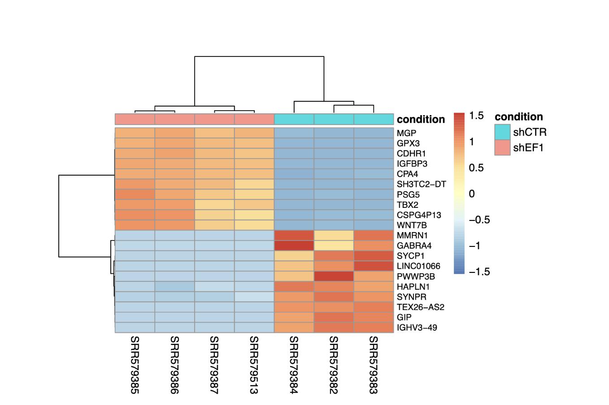

# Ewing Sarcoma
---
Ewing sarcoma is an aggressive malignancy that arises in bone or soft tissue and commonly presents with pain, swelling, or palpable masses, most often in the legs or pelvis. Over 85% of Ewing sarcoma cases are driven by the oncogenic fusion protein EWS–FLI, which is widely regarded as the primary driver of tumor initiation and progression. As such, understanding the molecular mechanisms by which EWS–FLI alters gene regulation is essential for elucidating Ewing sarcoma tumorigenesis, gaining broader insight into ETS-associated cancers, and identifying potential therapeutic targets.

In this project, I analyzed publicly available RNA-sequencing data from the NCBI Gene Expression Omnibus (accession number PRJNA176544), generated by the Huntsman Cancer Institute. The objective of this study was to investigate how EWS–FLI regulates gene expression in Ewing sarcoma by examining the effects of EWS–FLI knockdown. The dataset consists of seven samples, including three control samples and four EWS–FLI knockdown samples. After downloading the count matrix from NCBI, I performed differential gene expression analysis to identify genes that are significantly altered between conditions. These genes were subsequently annotated and analyzed at the pathway level to better understand which biological functions and pathways are restored following EWS–FLI knockdown.

Principal component analysis (PCA) reveals a clear separation between control (shCTR) and EWS–FLI knockdown (shEF1) samples, with PC1 explaining 98% of the total variance. This indicates that EWS–FLI knockdown is the primary driver of transcriptional variation in this dataset. In addition, biological replicates cluster tightly within each condition, suggesting high data quality and minimal batch effects.

 

Next, I used a volcano plot to visualize differentially expressed genes following EWS–FLI knockdown. In total, 3,086 genes were upregulated and 1,455 genes were downregulated. Genes located farther from the origin and higher along the y-axis represent strong candidates for biological relevance. Notably, highly upregulated genes include MGP, GPX3, and IGFBP3, while prominent downregulated genes include MMRN1, GABRA4, and SYNPR.

Finally, I generated heatmaps of the top upregulated and downregulated genes to further illustrate expression patterns and sample clustering across conditions.

Gene Ontology (left) and KEGG pathway (right) enrichment analyses reveal distinct biological programs that are activated or suppressed following EWS–FLI knockdown. Activated terms are enriched for extracellular matrix organization, collagen binding, focal adhesion, and ECM–receptor interactions, suggesting restoration of cell–matrix interactions and differentiation-associated programs. In contrast, suppressed terms are dominated by ribosomal function, RNA splicing, DNA replication, and cell-cycle–related pathways, indicating downregulation of proliferative and biosynthetic processes. Together, these results support a model in which EWS–FLI maintains oncogenic programs by promoting proliferation and transcriptional machinery while repressing extracellular matrix–related and differentiation pathways in Ewing sarcoma.

